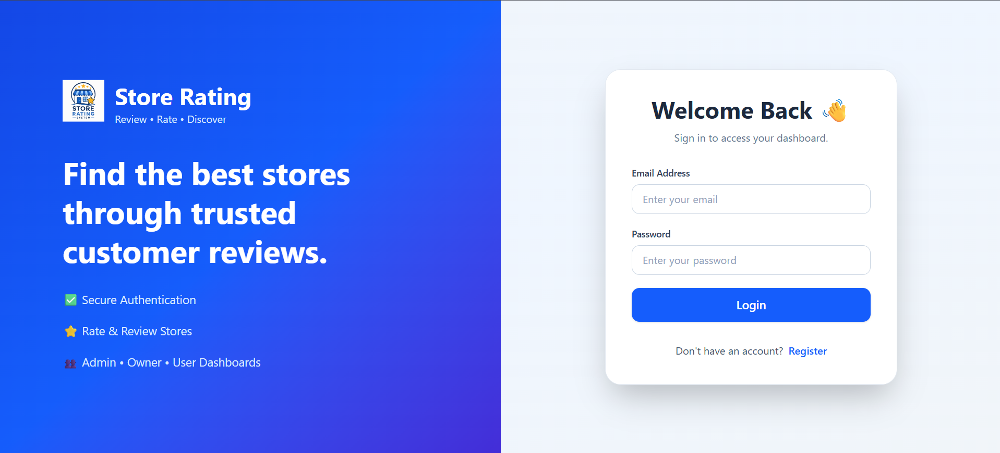
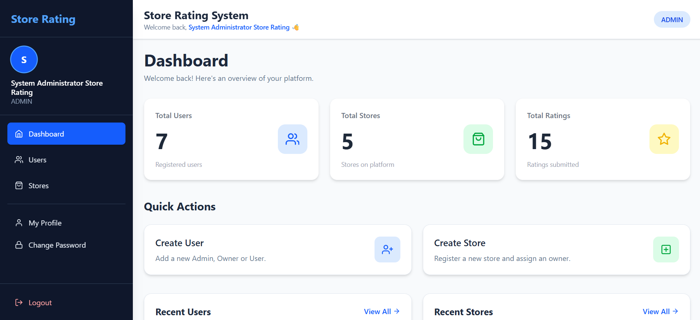
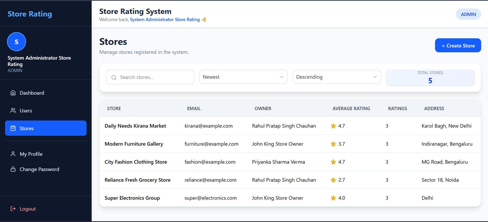
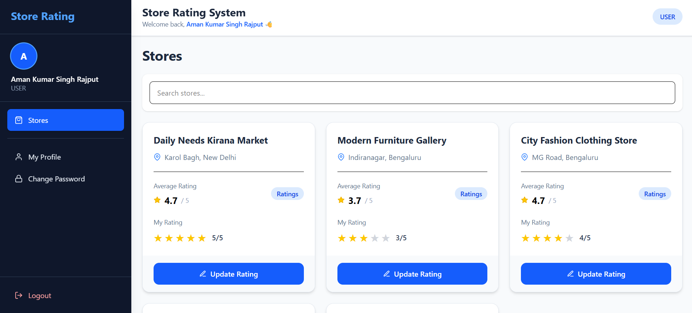

# ⭐ Store Rating System

A full-stack Store Rating System built with **React, Node.js, Express, Prisma, and MySQL**. The application allows users to rate stores, store owners to view ratings for their stores, and administrators to manage users and stores through a secure role-based dashboard.

## 🌐 Live Demo

### Frontend
🔗 https://store-rating-system-coral.vercel.app/

### Backend API
🔗 https://store-rating-api-u1fv.onrender.com/

> **Note:** The backend is hosted on Render's free tier. The first request after a period of inactivity may take 30–60 seconds while the service wakes up.

---

# 📸 Screenshots

> Add your screenshots inside a `screenshots` folder.

| Login | Admin Dashboard |
|-------|-----------------|
|  |  |

| Users | Stores |
|-------|--------|
|  |  |

| Owner Dashboard | User Dashboard |
|-----------------|----------------|
|  |  |

---

# ✨ Features

## Authentication

- User Registration
- Secure Login
- JWT Authentication
- Protected Routes
- Logout
- Change Password
- Profile Page

---

## Admin

- Dashboard Overview
- Create Users
- Create Store Owners
- Create Stores
- View All Users
- View All Stores
- Search Users
- Search Stores
- Sort Users
- Sort Stores
- Pagination

---

## Store Owner

- Dashboard
- View Assigned Store
- View Average Rating
- View Customer Ratings

---

## User

- Register
- Login
- Browse Stores
- Search Stores
- Submit Ratings
- Update Ratings

---

## Validation

### Frontend

- Live Form Validation
- Email Validation
- Password Validation
- Name Validation
- Address Validation

### Backend

- Request Validation
- JWT Verification
- Role Authorization
- Duplicate Email Checks

---

## Responsive Design

- Desktop
- Tablet
- Mobile
- Collapsible Sidebar
- Responsive Tables
- Mobile Navigation

---

# 🛠 Tech Stack

## Frontend

- React
- React Router DOM
- Tailwind CSS
- Axios
- React Hook Form
- React Hot Toast
- React Icons
- Framer Motion

## Backend

- Node.js
- Express.js
- Prisma ORM
- JWT
- bcrypt
- Express Validator
- Helmet
- Morgan
- CORS

## Database

- MySQL (Aiven Cloud)

## Deployment

- Frontend → Vercel
- Backend → Render
- Database → Aiven

---

# 📁 Project Structure

```
store-rating-system
│
├── backend
│   ├── prisma
│   ├── src
│   │   ├── config
│   │   ├── controllers
│   │   ├── middleware
│   │   ├── repositories
│   │   ├── routes
│   │   ├── services
│   │   ├── utils
│   │   └── server.js
│   └── package.json
│
├── frontend
│   ├── public
│   ├── src
│   │   ├── components
│   │   ├── context
│   │   ├── pages
│   │   ├── routes
│   │   ├── services
│   │   └── App.jsx
│   └── package.json
│
└── README.md
```

---

# 🚀 Installation

## Clone Repository

```bash
git clone https://github.com/YOUR_USERNAME/store-rating-system.git

cd store-rating-system
```

---

## Backend Setup

```bash
cd backend

npm install
```

Create `.env`

```env
DATABASE_URL=your_database_url

JWT_SECRET=your_secret

PORT=5000
```

Run migrations

```bash
npx prisma migrate deploy
```

(Optional, if using seed data)

```bash
npm run seed
```

Start backend

```bash
npm run dev
```

---

## Frontend Setup

```bash
cd frontend

npm install
```

Create `.env`

```env
VITE_API_URL=http://localhost:5000
```

Start frontend

```bash
npm run dev
```

---

# 🔐 User Roles

| Role | Permissions |
|------|-------------|
| Admin | Manage Users, Owners, Stores |
| Store Owner | View Store Ratings |
| User | Browse & Rate Stores |

---

# 📡 API Endpoints

## Authentication

```
POST   /api/auth/register
POST   /api/auth/login
GET    /api/auth/profile
PUT    /api/auth/change-password
```

---

## Admin

```
GET    /api/admin/dashboard

GET    /api/admin/users
POST   /api/admin/users

GET    /api/admin/stores
POST   /api/admin/stores
```

---

## Owner

```
GET /api/owner/dashboard
```

---

## User

```
GET  /api/stores
POST /api/stores/:id/rating
PUT  /api/stores/:id/rating
```

---

# 🔒 Security Features

- JWT Authentication
- Password Hashing using bcrypt
- Protected API Routes
- Role-Based Authorization
- Input Validation
- Secure HTTP Headers using Helmet

---

# 📱 Responsive UI

The application is fully responsive and optimized for:

- Desktop
- Laptop
- Tablet
- Mobile Devices

---

# 🎯 Future Improvements

- Dark Mode
- Profile Picture Upload
- Store Categories
- Review Comments
- Email Verification
- Forgot Password
- Admin Analytics Charts
- Notifications

---

# 👨‍💻 Author

**Aman**

GitHub: https://github.com/YOUR_USERNAME

---

# 📄 License

This project is licensed under the MIT License.